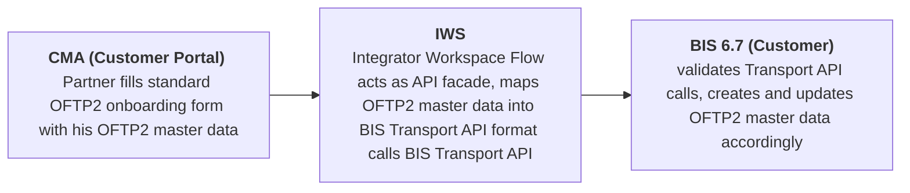

# OFTP2 Onboarding Service - Project Documentation

## Table of Contents
1. [Project Vision](#1-project-vision)
3. [Solution](#2-solution)
3. [Business](#3-business)
4. [Project](#4-project)
5. [Risk Assessment](#5-risk-assessment)


## 1 Project Vision

Manual partner onboarding for complex communication protocols such as OFTP2 is time-consuming and prone to errors. Seeburger provides **CMA** to support partner onboarding; however, preparing onboarding packages with CMA still requires significant effort. To increase customer adoption of CMA, an out-of-the-box solution is needed that minimizes configuration effort and enables a short time-to-value for productive use.

This project aims to provide a low-effort onboarding path for **OFTP2** partners for customers operating **BIS 6.7** (iPaaS and on-premises) using **CMA**. The primary objective is to minimize customer-side development and avoid any additional installation on the customer’s BIS runtime.


### Key Stakeholders

- **Product Owner**: Frank Stolle
- **Technical Lead**: TBD
- **Business Analyst**: TBD
- **Operations Lead**: TBD

## 2 Solution

### Overview

The solution introduces an API facade between **CMA** and **BIS 6.7**. The facade abstracts the underlying BIS 6.7 Transport API into a simplified, stable contract that CMA can consume.

The facade is implemented as an **Integrator Workspace (IWS)** flow. This keeps the integration logic outside the customer’s BIS runtime while providing an API surface for CMA-driven onboarding operations. The implementation also demonstrates a reusable IWS-based integration pattern for CMA ↔ BIS 6.7 scenarios.


### Breakdown

* Use the **BIS 6.7 Transport API** to bundle the creation, update, and assignment of all components required for an OFTP2 partner setup into a single API call. The Transport API also provides **built-in rollback**, reverting all changes if an error occurs.
* Encapsulate the business logic around the BIS Transport API in an **Integrator Workspace (IWS) flow**, which acts as a **facade API** callable by any client (in our case, CMA).
* Use **CMA’s API integration** feature to **generate** a CMA form for OFTP2 and connect it to the IWS flow.
* The IWS flow receives the relevant OFTP2 parameters from the CMA form and builds the payload for the BIS Transport API.
* **For new partners**: the flow retrieves an OFTP2 transport template from the customer’s BIS (including all required references and assignments), maps the partner-specific OFTP2 parameters into it, and submits it to BIS via the Transport API.
* **For existing partner updates**: if a transport for the partner already exists, the flow retrieves it from BIS, applies the updated OFTP2 parameters from CMA, and sends the updated transport back to BIS via the Transport API.
* The **facade API** can also be reused to integrate with other platforms or tools.
* Implement the facade using an **Integrator Workspace (IWS) flow** to keep it lightweight and avoid any additional installation on the customer’s BIS 6 system.

```mermaid
flowchart 
  CMA["CMA: partner fills OFTP2 form"] 

  subgraph IWS["IWS Flow (Facade)"]
    V["Get last Transport from Partner"]
    D{"Partner exists?"}

    subgraph no["Create New Partner"]
      N1["GET Transport Template from BIS"]
      N2["Map OFTP2 params from CMA into template"]
      N3["POST updated Template into BIS Transport API "]
      N1 --> N2 --> N3
    end

    subgraph yes["Update Existing Partner"]
      U1["GET last Transport of Partner from BIS"]
      U2["UPDATE: apply updated params"]
      U3["UPDATE: POST bundled Transport API call"]
      U1 --> U2 --> U3
    end

    V --> D
    D -->|No -> Create| N1
    D -->|Yes -> Update| U1
  end
 

  CMA --> V

  
  ```
## 3 Business

### Value Proposition

**For Customers:**
* **Cost Reduction:** A budget-friendly subscription model replaces high upfront development costs.
* **Out-of-the-Box:** Replaces manual onboarding preparation (via CMA) with a ready-to-use, standardized service.
* **Accelerated Time-to-Value:** Drastically reduces time-to-value from months to merely days.
* **Error Reduction:** A standardized cloud service minimizes the errors often associated with on-premise installations and highly customized solutions.
* **Convenience:** Requires zero software installation and handles all updates automatically.

**For Seeburger:**
* **Transformation:** Drives our internal learning and transition from traditional product offerings to service-based models.
* **Competitive Advantage:** Demonstrates market superiority by offering seamless, superior onboarding services.
* **Platform Bridge:** Serves as the crucial first point of contact for BIS 6 customers entering the IWS ecosystem.
* **Customer Insights:** Provides deeper, actionable visibility into exactly how customers utilize our products and services.
* **Future Opportunities:** Establishes a scalable foundation for future services, such as AS2, Communication Gateway, and more.

### Target Customers

- customers with more than 100 partners
- customers who are not using communication per B2B Routing Service

**Primary**
- **BIS 6.7 iPaaS**: Cloud-hosted BIS customers (iPaaS) with CMA cloud services, lowest support effort

**Secondary**
- **BIS 6.7 on-premises**: On premises BIS customers with CMA cloud services, medium support effort
- **BIS 6.7 any deployment** without CMA, new business

**Tertiary**
- **BIS 6.7 any deployment**: with CMA subscription, migrating to cloud services

**Industry Verticals:**

Industries where OFTP2 is comon:

- Automotive industry (OEMs, Tier 1-2 suppliers)
- Manufacturing companies
- Aerospace
- Logistics providers
- Retail supply chain partners

### Pricing Model

Current Pricing Model: 
- BASE:             550 EUR / month including provisioning and up to 20 onboardings / month
- UNLIMITED:      2.500 EUR / month including provisioning and unlimited onboardings
- API ADD-ON:       100 EUR / month usage of CMA API to manage partner onboardings per API

New Pricing Model
- BASE:             550 EUR / month including provisioning + up to 20 onboardings / month
- ENTERPRISE:     3.000 EUR / month including provisioning + unlimited onboardings + CMA API + OpenAPI integration + Content Packages ("OFTP2 Onboarding for BIS 6", ...)

**Expected Revenue p.a.**: 3.000 EUR x 12 month x 5 customer = **180.000 EUR**

### Costs

- **Development Project Effort**: 
  -  90 days development
  -  30 days cloud devops 
  -  15 days management  
  - **Total effort: 135 days**
- **Infrastructure**: Hosted as part of existing platform — **Marginal**
- **Maintenance**: Ongoing support — **Low**
- **Operations**: Monitoring, updates — **Low**


## 4 Project
### Timeline
```mermaid

gantt
  title Project Timeline — 2026
  excludes    weekends
  dateFormat  YYYY-MM-DD
  axisFormat  %b  (cw%W)
  tickInterval 1month
  weekDay monday
todayMarker off
  section Phases
  
  Kick-of       :milestone, s1, 2026-03-01, 0d
  Discovery   :d1, 2026-03-09, 15d
  Design      :d2, 2026-03-30, 15d
  Development :d3, 2026-04-20, 35d
  Testing     :d4, 2026-06-08, 10d
  Deployment  :d5, 2026-06-22, 15d
  Cloud DevOps      :d6, 2026-07-13, 30d
  Go-Live     :milestone, m1, 2026-08-25,0d
```
### Deliverables

* **OpenAPI Specification:** A complete API definition to automatically generate the OFTP2 configuration form within the CMA.
* **IWS Workflow & Mapping:** Fully configured integration flows and data mappings required to seamlessly create and update OFTP2 transports.
* **Cloud Service Deployment:** Complete provisioning and delivery of the CMA Enterprise Service within the SEEBURGER Cloud.
* **Comprehensive Documentation:** Tailored enablement materials, technical guides, and standard operating procedures (SOPs) for the Sales, Consulting, and Operations teams.

## 5 Risk Assessment

### Business Risks

| Risk | Likelihood | Impact | Mitigation |
|------|------------|--------|------------|
| Low adoption | High | Medium | Include in standard offering, minimize barrier |
| Scope creep | Medium | Medium | Phased approach, clear boundaries per phase |
| Resource constraints | Medium | Low | Leverage existing BIS capabilities |
| Competitor response | Low | Low | Native integration |

### Technical Risks

| Risk | Likelihood | Impact | Mitigation |
|------|------------|--------|------------|
| BIS mapping limitations | Low | Medium | Proven technology, existing patterns |
| Integration complexity | Medium | High | Investigated |
| IWS limitations | Medium | Medium | Addressed and not blocking |

### Strategic Risks

| Risk | Likelihood | Impact | Mitigation |
|------|------------|--------|------------|
| BIS 6.7 only | Medium | Low |  |
| Conflicts with  | Medium | Medium | Modular design for future protocols |


---

